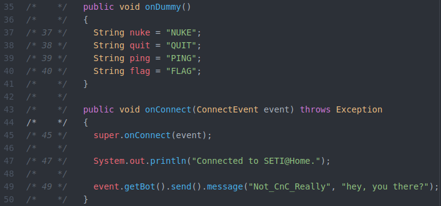

# Forensics 300

We were given .jar file `f300-1c9dd35c9fc6-SETI_at_HOME-1.0-OFFICIAL_LEGIT` with a description saying it was a sample retreived from an user affected by a big botnet.

---

## Decompiling
The first thing to do when faced with a .jar file is throwing it at a .jar decompiler like jd-gui


### Decompiled file tree


While checking the dependencies, I see it makes use of [pircbotx](https://github.com/pircbotx/pircbotx), which is an IRC library, meaning this is very likely an IRC based botnet.
Excluding dependencies, the program is made of three classes: `HmacSha1Signature`, `Run`, `Seti`.


### HMacSHA1Signature


I decided to take a look at HmacSha1Signature and immediately realized it was using HmacSHA1 to sign something. The calculateRFC2104HMAC function also has partial key `4963679043997443008263121116187603250317` hardcoded in it, which it concatenates to the key it receives as argument... interesting.


### CalculateRFC2104HMAC


Looking at the function calls, I found it was called from class `Seti` with key argument `0xDEADPOOL`. So I know have the full key: `0xDEADPOOL4963679043997443008263121116187603250317`. Cool! But I still don't know what I'll need it for.

At this point I decided to have a look at `Run`. It starts by doing some SSL crypto stuff, afterwards it creates a Servers LinkedList, adds `irc.freenode.net:6697` to it, defines Configuration with the following parameters
```
  setAutoReconnect: true,
  setAutoReconnectDelay: 1000,
  setAutoReconnectAttempts: Integer.MAX_VALUE,
  setLogin: "nobody"
  setRealName: "Unknown"
  setVersion: "Unknown",
  setName: "banana" + org.apache.commons.lang3.RandomStringUtils.randomAlphanumeric(10)),
  setAutoNickChange: true
```
adds class `Seti` as a Listener and then then starts the bot.

**Long story short:** It creates a persistent connection to `irc.freenode.net:6697` with name "banana" + 10 random alphanumeric characters, adds class `Seti` as a Listener and then it starts listening...


### Seti


Looking at Seti, something very interesting immediately calls my attention.

There are a few strings on the class that look like bot commands, and they are unreachable code, meaning this is very likely a hint.

Right after it, we have an onConnect function that sends `Not_CnC_Really` a message saying `"hey, you there?"`. It's calling home to the Control and Command bot.

At this point I decided to connect to freenode and message the CnC with the same message.. (`/msg Not_CnC_Really hey, you there?`) and it replied! `mar 21 23:35:08 <Not_CnC_Really>	hey dude, I received a text with the number 7204313532561788210442346, is it yours?`

Nice.


### onGenericMessage


Looking back at the beginning of the `Seti` class, I realized it's doing something with that number that the CnC sends. It sends the number to the calculateRFC2014HMAC function (to which we already have the key), stores the result on var `challenge_response`, and then replies back to the CnC `"did it have this message: " + challenge_response + " ?"`.

So, I now have to sign the CnC number sequence and send the result back to him.. I call calculateRFC2014HMAC with the number that the bot sends and the same hardcoded key, then send the result (with the format above) back to the CnC and the result was...
```
mar 21 23:58:14 <banana_123456788>	PING
mar 21 23:58:14 <Not_CnC_Really>	hey dude, I received a text with the number 6751369955099512710058471, is it yours?
mar 21 23:59:41 <banana_123456788>	did it have this message: 8c2caf91d50b84dabef003dad631f25fed446cba ?
mar 21 23:59:42 <Not_CnC_Really>	yes, exacly!
mar 21 23:59:42 <Not_CnC_Really>	join me on ##chiquita_banana channel
mar 21 23:59:42 *	You have been invited to ##chiquita_banana by Not_CnC_Really (sinisalo.freenode.net)
```
Bingo!

I entered the channel, and saw the CnC and a few other client users. Then I sent the commands from that function from `Seti`
```
mar 22 00:00:18 *	Now talking on ##chiquita_banana
mar 22 00:00:18 <Not_CnC_Really>	Hey there, banana_123456788!
mar 22 00:00:53 <banana_123456788>	STOP
mar 22 00:01:00 <banana_123456788>	PING
mar 22 00:01:00 <Not_CnC_Really>	banana_123456788: pong!
mar 22 00:01:23 <banana_123456788>	NUKE
mar 22 00:01:23 <Not_CnC_Really>	banana_123456788: i've sent a message to kim jong un to launch a missile ;)
mar 22 00:01:25 <banana_123456788>	QUIT
mar 22 00:01:26 <Not_CnC_Really>	banana_123456788: I'd rather not..
mar 22 00:01:43 <banana_123456788>	FLAG
mar 22 00:01:44 <Not_CnC_Really>	banana_123456788: that's sensitive information..
```
And got the flag from the CnC via private message!
```
mar 22 00:01:44 <Not_CnC_Really>	flag{old_school_irc_botnets_are_cute}
```
GG!

Unfortunately, I only finished the challenge some 5 minutes after the CTF ended :(

Nevertheless, this was a really cool challenge, and I did end up solving it


## Extra: Executing
I randomly attempted running the file just to see what would happen, but nothing useful happens other than the start-up message.
```
Starting SETI@Home..
Connected to SETI@Home.
```
